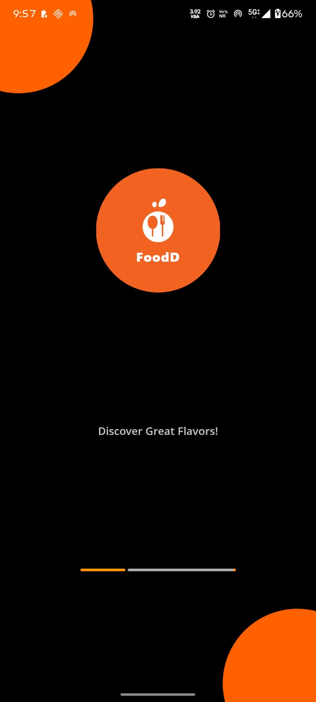
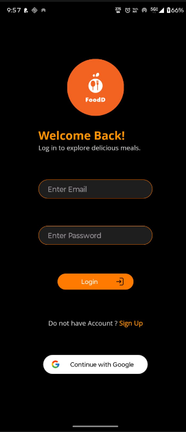
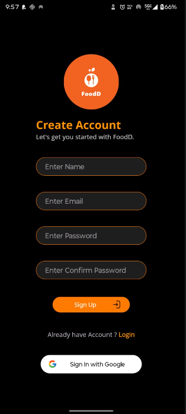
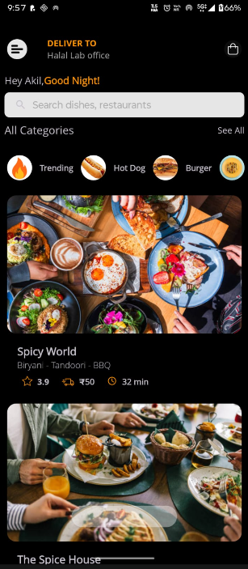
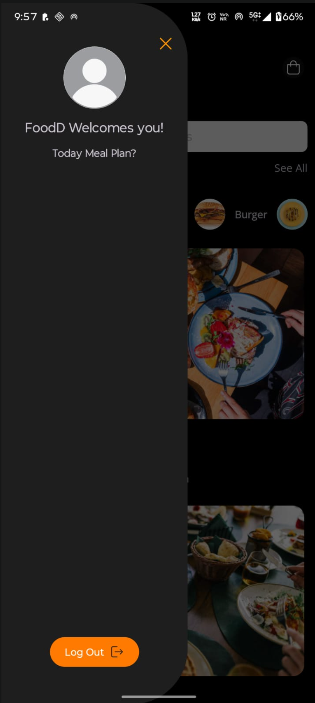

# FoodD - Android App

A feature-rich Android food delivery application built with Java, Firebase, and Material Design, enabling users to browse restaurants, manage orders, and track deliveries with an intuitive and responsive user interface.

**Repository:** [Akilesh-GA/FoodD](https://github.com/Akilesh-GA/FoodD)

---

## Overview

FoodD is a production-ready Android application that provides a seamless food delivery experience. It implements modern Android development practices with a clean modular architecture, Firebase backend integration, and Material Design principles for an intuitive user experience.

**Key Features:**
- User Authentication & Authorization (Firebase Auth)
- Browse restaurants and food items
- Add items to cart and manage orders
- Real-time order tracking
- Payment integration
- User profile management
- Push notifications
- Minimal AI-assisted code generation for scalability
- Responsive Material Design UI
- Modular architecture with custom adapters

---

## Tech Stack

**Mobile Framework**
- Android (Java/Kotlin support)
- Android Studio IDE
- Gradle Build System

**Backend Integration**
- Firebase Authentication
- Firebase Realtime Database / Firestore
- Firebase Cloud Messaging (FCM)
- Firebase Storage

**UI/UX Framework**
- Material Design 3
- AndroidX Libraries
- RecyclerView for dynamic lists
- Custom Adapters
- ConstraintLayout for responsive design

**Additional Libraries**
- Retrofit (API calls)
- Glide/Picasso (Image loading)
- LiveData & ViewModel (MVVM Architecture)
- Room Database (Local caching)
- Gson (JSON serialization)

**Build & Deployment**
- Gradle 7.x+
- Android SDK 31+
- Min SDK: 24
- Target SDK: 33+

---

## Workflow Screenshots

### Splash Screen


### Login Screen


### Sign In Screen


### Home Screen


### Menu Screen


---

## Architecture

### MVVM Architecture Pattern

```
┌─────────────────────────────────────────────────┐
│         PRESENTATION LAYER                      │
│  Activities & Fragments (UI Components)         │
│  - Display data to user                         │
│  - Handle user interactions                     │
│  - Observe ViewModel changes                    │
└──────────────────┬──────────────────────────────┘
                   │
                   ▼
┌─────────────────────────────────────────────────┐
│         VIEW MODEL LAYER                        │
│  ViewModels & LiveData                          │
│  - Hold UI-related data                         │
│  - Survive configuration changes                │
│  - Manage UI state                              │
└──────────────────┬──────────────────────────────┘
                   │
                   ▼
┌─────────────────────────────────────────────────┐
│         BUSINESS LOGIC LAYER                    │
│  Repository & Use Cases                         │
│  - Fetch from local database                    │
│  - Fetch from remote API                        │
│  - Transform data                               │
└──────────────────┬──────────────────────────────┘
                   │
                   ▼
┌─────────────────────────────────────────────────┐
│         DATA LAYER                              │
│  Firebase & Local Database (Room)               │
│  - Firebase Authentication                      │
│  - Firestore / Realtime Database                │
│  - Local Room Database                          │
└─────────────────────────────────────────────────┘
```
---

## Getting Started

### Prerequisites

- Android Studio 2021.3+
- Java 11 or higher
- Android SDK 31+
- Min SDK: 24
- Google Play Services
- Firebase Project configured

### Installation

**Step 1: Clone the Repository**

```bash
git clone https://github.com/Akilesh-GA/FoodD.git
cd FoodD
```

**Step 2: Open in Android Studio**

- Open Android Studio
- Select "Open an Existing Project"
- Navigate to the cloned FoodD directory
- Android Studio will automatically download Gradle dependencies

**Step 3: Configure Firebase**

1. Go to [Firebase Console](https://console.firebase.google.com/)
2. Create a new project or select existing project
3. Add an Android app to your Firebase project
4. Download the `google-services.json` file
5. Place it in the `app/` directory

**Step 4: Update Firebase Configuration (if needed)**

Edit `app/build.gradle`:

```gradle
dependencies {
    // Firebase
    implementation 'com.google.firebase:firebase-auth:21.1.0'
    implementation 'com.google.firebase:firebase-firestore:24.4.0'
    implementation 'com.google.firebase:firebase-storage:20.1.0'
    implementation 'com.google.firebase:firebase-messaging:23.1.1'
}
```

**Step 5: Build & Run the Application**

```bash
# Build the project
./gradlew build

# Run on emulator or connected device
./gradlew installDebug
```

Or simply click the "Run" button in Android Studio (Shift + F10).

---

## Key Features & Usage

### 1. User Authentication

**Login/Signup**
- Firebase Authentication (Email & Password)
- Input validation
- Error handling
- Session persistence using SharedPreferences

```java
// Example: Login Implementation
FirebaseAuth.getInstance().signInWithEmailAndPassword(email, password)
    .addOnSuccessListener(task -> {
        // Navigate to MainActivity
    })
    .addOnFailureListener(e -> {
        // Show error message
    });
```

### 2. Browse Restaurants

**Home Fragment**
- RecyclerView displays list of restaurants
- RestaurantAdapter with ViewHolder pattern
- Glide for image loading
- Click listener for restaurant details

### 3. View Food Items

**Detail Activity**
- Restaurant details with ratings
- Menu items in grid/list format
- Add items to cart
- Item quantity selector

### 4. Shopping Cart

**Cart Management**
- Add/remove items
- Quantity adjustment
- Live price calculation using LiveData
- CartViewModel handles state management
- Room Database for local cart persistence

### 5. Order Placement & Tracking

**Order Flow**
- Checkout with delivery address
- Payment method selection
- Real-time order status updates via Firebase Listener
- Order history in OrdersFragment

### 6. User Profile

**Profile Management**
- View/edit user details
- Manage delivery addresses
- Payment methods
- Order history
- Logout functionality

---

## Firebase Integration

### Authentication Setup

```java
public class FirebaseHelper {
    private static FirebaseAuth mAuth = FirebaseAuth.getInstance();
    
    public static void registerUser(String email, String password, AuthCallback callback) {
        mAuth.createUserWithEmailAndPassword(email, password)
            .addOnSuccessListener(task -> callback.onSuccess())
            .addOnFailureListener(e -> callback.onError(e.getMessage()));
    }
}
```

### Firestore Database Structure

```
users/
  └── {uid}
      ├── email: string
      ├── name: string
      ├── phone: string
      └── addresses: array

restaurants/
  └── {restaurantId}
      ├── name: string
      ├── rating: float
      ├── image: string
      └── menu: array

orders/
  └── {orderId}
      ├── userId: string
      ├── restaurantId: string
      ├── items: array
      ├── status: string (pending/confirmed/delivered)
      ├── totalAmount: float
      └── createdAt: timestamp
```

---

## Material Design & UI Components

### Bottom Navigation

```xml
<com.google.android.material.bottomnavigation.BottomNavigationView
    android:id="@+id/bottom_nav"
    android:layout_width="match_parent"
    android:layout_height="wrap_content"
    app:menu="@menu/bottom_nav_menu" />
```

### RecyclerView Implementation

```java
RecyclerView recyclerView = findViewById(R.id.recyclerView);
RestaurantAdapter adapter = new RestaurantAdapter(restaurantList);
recyclerView.setLayoutManager(new LinearLayoutManager(this));
recyclerView.setAdapter(adapter);
```

### Custom Adapter Pattern

```java
public class RestaurantAdapter extends RecyclerView.Adapter<RestaurantAdapter.ViewHolder> {
    private List<Restaurant> restaurants;
    private OnItemClickListener listener;
    
    public class ViewHolder extends RecyclerView.ViewHolder {
        ImageView restaurantImage;
        TextView restaurantName;
        TextView rating;
        
        public ViewHolder(View itemView) {
            super(itemView);
            restaurantImage = itemView.findViewById(R.id.image);
            restaurantName = itemView.findViewById(R.id.name);
            rating = itemView.findViewById(R.id.rating);
        }
    }
}
```

---

## ViewModel & LiveData

### Cart ViewModel Example

```java
public class CartViewModel extends ViewModel {
    private MutableLiveData<List<CartItem>> cartItems = new MutableLiveData<>();
    private MutableLiveData<Double> totalPrice = new MutableLiveData<>();
    
    public LiveData<List<CartItem>> getCartItems() {
        return cartItems;
    }
    
    public void addItem(CartItem item) {
        List<CartItem> current = cartItems.getValue();
        current.add(item);
        cartItems.setValue(current);
        calculateTotal();
    }
    
    private void calculateTotal() {
        double total = cartItems.getValue().stream()
            .mapToDouble(item -> item.getPrice() * item.getQuantity())
            .sum();
        totalPrice.setValue(total);
    }
}
```

---

## Room Database (Local Caching)

### Entity Definition

```java
@Entity
public class CartEntity {
    @PrimaryKey
    public long id;
    public String itemName;
    public double price;
    public int quantity;
}
```

### DAO Interface

```java
@Dao
public interface CartDao {
    @Insert
    void insertItem(CartEntity item);
    
    @Query("SELECT * FROM cart")
    List<CartEntity> getAllItems();
    
    @Delete
    void deleteItem(CartEntity item);
}
```

### Database Class

```java
@Database(entities = {CartEntity.class}, version = 1)
public abstract class AppDatabase extends RoomDatabase {
    public abstract CartDao cartDao();
}
```

---

## API Integration (Retrofit)

```java
public interface FoodDAPI {
    @GET("restaurants")
    Call<List<Restaurant>> getRestaurants();
    
    @GET("restaurants/{id}/menu")
    Call<List<FoodItem>> getMenuItems(@Path("id") String restaurantId);
    
    @POST("orders")
    Call<Order> createOrder(@Body Order order);
}
```

---

## Building & Deployment

### Build Variants

**Debug Build**
```bash
./gradlew assembleDebug
```

**Release Build**
```bash
./gradlew assembleRelease
```

### App Signing

Configure in `app/build.gradle`:

```gradle
android {
    signingConfigs {
        release {
            keyAlias 'release-key'
            keyPassword 'your_key_password'
            storeFile file('keystore.jks')
            storePassword 'your_store_password'
        }
    }
}
```

### Generate APK

```bash
./gradlew build
# APK location: app/build/outputs/apk/release/app-release.apk
```

### Upload to Play Store

1. Sign up for Google Play Developer Console
2. Create new app
3. Fill in store listing details
4. Upload signed APK (min SDK 24)
5. Submit for review

---

## Testing

### Unit Tests

```java
@RunWith(AndroidUnit4.class)
public class CartViewModelTest {
    @Test
    public void testAddItem() {
        CartViewModel viewModel = new CartViewModel();
        CartItem item = new CartItem("Pizza", 250);
        viewModel.addItem(item);
        
        assertEquals(250, viewModel.getTotalPrice());
    }
}
```

### Instrumented Tests

```bash
./gradlew connectedAndroidTest
```

---

## Permissions

Add to `AndroidManifest.xml`:

```xml
<!-- Internet -->
<uses-permission android:name="android.permission.INTERNET" />

<!-- Location -->
<uses-permission android:name="android.permission.ACCESS_FINE_LOCATION" />
<uses-permission android:name="android.permission.ACCESS_COARSE_LOCATION" />

<!-- Notifications -->
<uses-permission android:name="android.permission.POST_NOTIFICATIONS" />

<!-- Camera (if needed for profile pictures) -->
<uses-permission android:name="android.permission.CAMERA" />

<!-- Read External Storage -->
<uses-permission android:name="android.permission.READ_EXTERNAL_STORAGE" />
```

---

## Configuration Files

### build.gradle (Project Level)

```gradle
buildscript {
    repositories {
        google()
        mavenCentral()
    }
    dependencies {
        classpath 'com.android.tools.build:gradle:7.4.0'
        classpath 'com.google.gms:google-services:4.3.15'
    }
}
```

### build.gradle (App Level)

```gradle
plugins {
    id 'com.android.application'
    id 'com.google.gms.google-services'
}

android {
    compileSdk 33
    
    defaultConfig {
        applicationId "com.example.foodd"
        minSdk 24
        targetSdk 33
        versionCode 1
        versionName "1.0.0"
    }
    
    buildTypes {
        release {
            minifyEnabled false
            proguardFiles getDefaultProguardFile('proguard-android.txt'), 'proguard-rules.pro'
        }
    }
}

dependencies {
    // Core Android
    implementation 'androidx.appcompat:appcompat:1.6.1'
    implementation 'androidx.constraintlayout:constraintlayout:2.1.4'
    
    // Firebase
    implementation 'com.google.firebase:firebase-auth:21.1.0'
    implementation 'com.google.firebase:firebase-firestore:24.4.0'
    implementation 'com.google.firebase:firebase-messaging:23.1.1'
    
    // Material Design
    implementation 'com.google.android.material:material:1.9.0'
    
    // Retrofit & Gson
    implementation 'com.squareup.retrofit2:retrofit:2.9.0'
    implementation 'com.squareup.retrofit2:converter-gson:2.9.0'
    
    // Image Loading
    implementation 'com.github.bumptech.glide:glide:4.15.1'
    
    // Room Database
    implementation 'androidx.room:room-runtime:2.5.2'
    annotationProcessor 'androidx.room:room-compiler:2.5.2'
    
    // LiveData & ViewModel
    implementation 'androidx.lifecycle:lifecycle-viewmodel:2.6.1'
    implementation 'androidx.lifecycle:lifecycle-livedata:2.6.1'
    
    // Testing
    testImplementation 'junit:junit:4.13.2'
    androidTestImplementation 'androidx.test.espresso:espresso-core:3.5.1'
}
```

---

## Best Practices

1. **Architecture**: Follow MVVM with Repository pattern
2. **State Management**: Use ViewModel & LiveData for UI state
3. **Database**: Use Room for local data persistence
4. **Networking**: Use Retrofit with proper error handling
5. **Security**: Never store sensitive data in SharedPreferences
6. **Performance**: Use RecyclerView.DiffUtil for list updates
7. **Threading**: Use Coroutines or LiveData for async operations
8. **Testing**: Write unit & instrumented tests
9. **Code Style**: Follow Google's Android Code Style Guide
10. **Logging**: Use Android Timber or Logback for debugging

---

## Troubleshooting

### Common Issues

**1. Firebase SDK not found**
```bash
./gradlew clean build
```

**2. Gradle Sync Failed**
- Invalidate caches: File → Invalidate Caches
- Update Gradle: Tools → SDK Manager

**3. Build Errors**
- Check Java version compatibility
- Verify `google-services.json` is in `app/` folder
- Ensure SDK versions match in build.gradle

---

## Resources

**Android Development**
- [Android Official Docs](https://developer.android.com/)
- [Android Architecture Components](https://developer.android.com/topic/libraries/architecture)
- [Material Design Guidelines](https://material.io/design)

**Firebase**
- [Firebase Documentation](https://firebase.google.com/docs)
- [Firebase Authentication](https://firebase.google.com/docs/auth)
- [Firebase Firestore](https://firebase.google.com/docs/firestore)

**Libraries**
- [Retrofit Documentation](https://square.github.io/retrofit/)
- [Room Database](https://developer.android.com/topic/libraries/architecture/room)
- [Glide Image Loading](https://github.com/bumptech/glide)

**Tools**
- [Android Studio](https://developer.android.com/studio)
- [Google Play Console](https://play.google.com/console)
- [Firebase Console](https://console.firebase.google.com/)

---

## Contributing

Contributions are welcome! Please follow the guidelines:

1. Fork the repository
2. Create a feature branch: `git checkout -b feature/your-feature`
3. Commit changes: `git commit -m 'Add feature'`
4. Push to branch: `git push origin feature/your-feature`
5. Submit a Pull Request

---

## License

This project is open-source and available under the MIT License.

---

## Author

**Akilesh-GA**
- GitHub: [@Akilesh-GA](https://github.com/Akilesh-GA)
- Repository: [FoodD](https://github.com/Akilesh-GA/FoodD)

---

## Version History

- **v1.0.0** (Current)
  - Initial release
  - User authentication with Firebase
  - Restaurant browsing
  - Shopping cart management
  - Order placement & tracking
  - User profile management
  - Push notifications via FCM
  - Material Design UI

---

## Support

For issues, questions, or suggestions:
- Open an issue on GitHub
- Contact: akilesh.ga@example.com

---

**Last Updated:** August 2026
**Status:** Active Development
